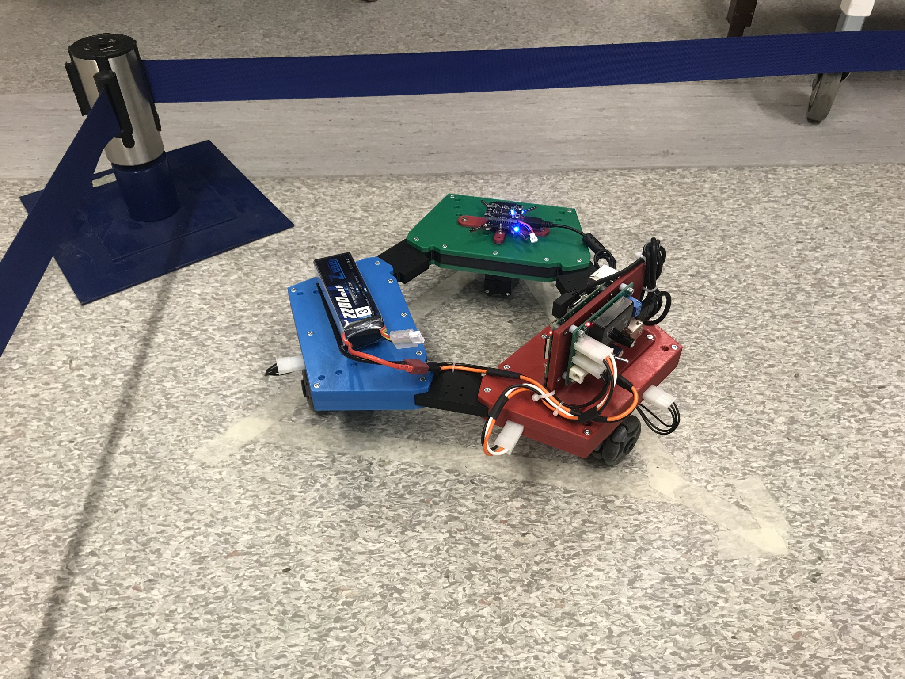

# frtn01-omnibot

Control of the three-wheeled omnibot can be made very precise due to its structure. This project focuses on two main ways of control, classic PID control as is used widely in the industry and also with the use of Harmonic Control Arrays (HCA).

